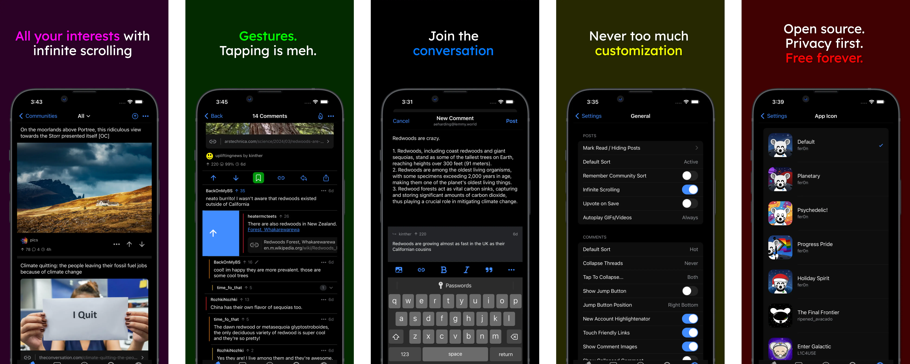

<p align="center">
  <a href="https://vger.app" target="_blank" rel="noopener noreferrer">
    
  </a>
</p>

<h1 align="center"/>Voyager</h1>

<p align="center">
A mobile-first Lemmy web client
</p>

<p align="center">
<a href="https://github.com/aeharding/voyager/issues/new?assignees=&labels=bug&projects=&template=bug_report.md&title=">Report Bug</a> · <a href="https://github.com/aeharding/voyager/issues/new?assignees=&labels=enhancement&projects=&template=feature_request.md&title=">Request Feature</a> · <a href="https://github.com/aeharding/voyager/releases">Releases</a>
</p>

<p align="center">
&nbsp;<a href="https://vger.app"></a>&nbsp;&#8203;&nbsp;
<a href="https://apps.apple.com/us/app/voyager-for-lemmy/id6451429762"></a>&nbsp;&nbsp;
<a href="https://play.google.com/store/apps/details?id=app.vger.voyager"></a>&nbsp;&nbsp;<a href="https://f-droid.org/en/packages/app.vger.voyager/"></a>
</p>
<p align="center">
  <a href="https://matrix.to/#/#vger.app:matrix.org"></a>
  <a href="https://lemmyverse.link/c/voyagerapp@lemmy.world"></a>
</p>
<br/>

<p align="center">
  <a href="https://vger.app/" target="_blank" rel="noopener noreferrer" >
    
  </a>
</p>

## Voyager for Lemmy

Voyager is an [Apollo-like](https://apolloapp.io/) open source web client for [Lemmy](https://join-lemmy.org/). It's a mobile-first app, but works great on desktop devices, too. Please feel free to try it out!

**What does Voyager currently support?**

- Light/dark mode
- View and subscribe to communities
- Multi account support
- Single comment thread context view
- Upvote, downvote and reply to threads and comments
- Interact with user profiles
- Comment thread collapsing
- A bunch of swipe gestures
- Messaging, mentions and replies
- Creating new posts (url/photo/text)
- Deleting/editing comments
- Deleting/editing posts
- Swipe to hide posts
- Saving/bookmarking
- Favorites
- Android theme (beta)

**What is on the roadmap?**

- More customization
- Native notifications and badging
- Mod features
- Translations
- ...and more!

## 💪 Mobile webapps are awesome

Native apps can be great, but we believe in the strengths of the web. Why use a web-based Lemmy client?

- **Cross-platform** Use the familiar Voyager interface on your phone, tablet, desktop computer, and more!
- **Self-hostable** No worries about your favorite app getting taken down, and you can customize to your desire!
- **Lightweight** No large installation bundles - and it's easy to try it out

## Deployment

### Ecosystem

**For most users,** we recommend the native app available in the stores:

<a href="https://apps.apple.com/us/app/voyager-for-lemmy/id6451429762"></a>&nbsp;&nbsp;
<a href="https://play.google.com/store/apps/details?id=app.vger.voyager"></a>&nbsp;&nbsp;<a href="https://f-droid.org/en/packages/app.vger.voyager/"></a>

However, if you prefer using the Progressive Web App, there are a number of folks that host it:

| Country          | URL                                                      | Description                                                  | Contact/Privacy                             |
| ---------------- | -------------------------------------------------------- | ------------------------------------------------------------ | ------------------------------------------- |
| 🇺🇸 Virginia, USA | [vger.app](https://vger.app)                             | ✅ Official Voyager PWA instance                             | [➡️](https://vger.social/u/aeharding)       |
| 🇫🇮 Finland       | [m.lemmy.world](https://m.lemmy.world)                   | Voyager hosted by the mastodon.world team.                   | [➡️](https://mastodon.world/about)          |
| 🇸🇬 Singapore     | [v.opnxng.com](https://v.opnxng.com)                     | Voyager hosted by Opnxng in Singapore.                       | [➡️](https://about.opnxng.com)              |
| 🇲🇽 Mexico        | [voyager.nohost.network](https://voyager.nohost.network) | Voyager hosted by Nohost in Mexico.                          | [➡️](https://nohost.network)                |
| 🇺🇸 USA           | [vger.thesanewriter.com](https://vger.thesanewriter.com) | Voyager hosted by the lemmy.thesanewriter.com team.          | [➡️](https://lemmy.thesanewriter.com/legal) |
| 🇺🇸 Oregon, USA   | [m.lemmy.today](https://m.lemmy.today)                   | A fast, general purpose instance located in Oregon, USA      | [➡️](https://lemmy.today)                   |
| 🇫🇷 France        | [v.lemmy.dbzer0.com](https://v.lemmy.dbzer0.com)         | Be Weird, Download a Car, Generate Art, Screw Copyrights     | [➡️](https://lemmy.dbzer0.com)              |
| ?                | [v.programming.dev](https://v.programming.dev)           | A collection of programming communities                      | [➡️](https://legal.programming.dev)         |
| 🇺🇸 Oregon, USA   | [v.lemmy.eco.br](https://v.lemmy.eco.br)                 | A fast, general purpose instance located in Oregon, USA      | [➡️](https://lemmy.eco.br)                  |
| 🇩🇪 Germany       | [v.lemy.lol](https://v.lemy.lol)                         | Long-term, general purpose Lemmy instance.                   | [➡️](https://lemy.lol)                      |
| 🇵🇹 Portugal      | [voyager.slrpnk.net](https://voyager.slrpnk.net)         | Sustainable future interconnected with nature and community. | [➡️](https://slrpnk.net)                    |
| ?                | [app.thelemmy.club](https://app.thelemmy.club)           | A general Lemmy instance for all!                            | [➡️](https://thelemmy.club)                 |
| ?                | [m.lemdro.id](https://m.lemdro.id)                       | Fully open source instance with incredible transparency.     | [➡️](https://lemdro.id)                     |

> **Note**: Community deployments are **NOT** maintained by the Voyager team. They may not be synced with Voyager's source code. Please do your own research about the host servers before using them.

### Self-Host

There are two ways you can run Voyager as a PWA in a production environment. The recommended method is using **docker**. We also support a **traditional** deployment method without docker. Read below to see how to get each method set up.

#### Environment variables

- `CUSTOM_LEMMY_SERVERS` (optional) e.g. `lemmy.world,lemmy.ml,sh.itjust.works` - a comma separated list of suggested servers. The first will be used as default view for logged out users. You can specify only one if you want.

#### Docker Deployment

In order to host Voyager yourself you can use the provided Dockerfile to build a container with Voyager. The Docker container itself does not provide any SSL/TLS handling. You'll have to add this bit yourself.
One could put Voyager behind popular reverse proxies with SSL Handling like Traefik, NGINX etc.

> **Tip:** Use [Watchtower](https://github.com/containrrr/watchtower) to keep your deployment automatically up to date!

##### From source

1. checkout source `git clone https://github.com/aeharding/voyager.git`
1. go into new source dir: `cd voyager`
1. build Docker image: `docker build . -t voyager`
1. start container: `docker run --init --rm -it -p 5314:5314 voyager`

##### Prebuilt

1. pull image `docker pull ghcr.io/aeharding/voyager:latest`
1. start container: `docker run --init --rm -it -p 5314:5314 voyager`

Note: The provided Dockerfile creates a container which will eventually run Voyager as non-root user.

#### Traditional Deployment

While Docker makes things easier, Voyager can be hosted by any HTTP server (nginx, apache etc).

```sh
# Build from source (Or, download web artifact from Github Releases)
pnpm install
pnpm build

# Then, serve ./dist with your favorite HTTP server - nginx, apache etc
# (make sure 404 goes to index.html)
# Below is a simple example for dev/testing (not recommended for production):
npm install --global http-server
cp dist/index.html dist/404.html # magic file for http-server
http-server dist
```

Optionally, you can serve a custom list of instance(s) in the `/_config` endpoint, with JSON payload of following format:

```json
{ "customServers": ["lemmy.world", "lemm.ee"] }
```

For production, serve `index.html` with `Cache-Control: no-cache` and `/assets` with a long cache period (files in assets are immutable)

## 💖 Sponsors

If you're enjoying Voyager, you can sponsor it:

- [Alexander Harding](https://github.com/sponsors/aeharding)

We would also appreciate sponsoring other contributors to Voyager. If someone helps you solve an issue or implement a feature you wanted, supporting them would help make this project and OS more sustainable.

## 🧑‍💻 Contributing

Please check out [CONTRIBUTING.md](./CONTRIBUTING.md) for details on contributing to Voyager. Thank you! 💙

## 🛜 Add a lemmy instance to the curated list

Voyager curates Lemmy servers for sign up ([see the data](./src/features/auth/login/data/servers.ts)). If you would like to add an instance, please read the [curated servers policy](./src/features/auth/login/data/README.md).

## 📲 PWA

Voyager works best added to the homescreen. There are certain features that only work there, like badging and smooth page transitions.

## 🦄 Stack

- [React](https://react.dev/) - The library for web and native user interfaces
- [Vite](https://vitejs.dev/) - Next Generation Frontend Tooling
- [Ionic](https://ionicframework.com/) - The mobile SDK for the Web
- [Virtua](https://github.com/inokawa/virtua) - A zero-config, fast and small virtual list
- [vite-plugin-pwa](https://github.com/vite-pwa/vite-plugin-pwa) - Prompt for update, Web Push Notifications and Web Share Target API

## 👨‍💻 Contributors

Shoutout to [@fer0n](https://github.com/fer0n) for the great logo and splashscreen! And thank you 💙 all of our contributors to the codebase:

<a href="https://github.com/aeharding/voyager/graphs/contributors">
  
</a>

## 📄 License

### Artwork

- **Default Logo & Splashscreen**: CC BY-SA 4.0 &copy; [@fer0n](https://github.com/fer0n)
- **Default Android themed icon**: CC BY-SA 4.0 &copy; [@Donno](https://github.com/Donnnno)

### Code

[AGPL-3.0](./LICENSE) &copy; Voyager contributors
