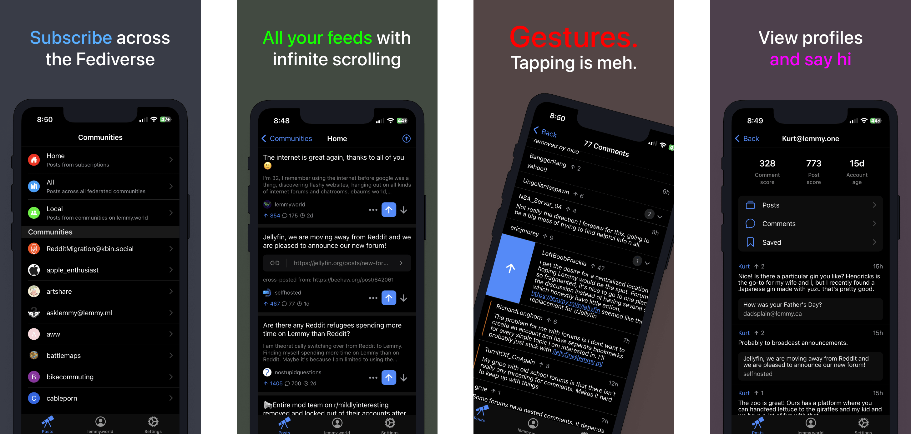

<p align="center">
  <a href="https://vger.app" target="_blank" rel="noopener noreferrer">
    
  </a>
</p>

<h1 align="center"/>Voyager</h1>

<p align="center">
A mobile-first Lemmy web client
</p>

<p align="center">
(formerly wefwef)
</p>

<br/>
<p align="center">
  <a href="https://matrix.to/#/#vger.app:matrix.org"></a>
</p>
<br/>

<p align="center">
  <a href="https://vger.app/" target="_blank" rel="noopener noreferrer" >
    
  </a>
</p>

## Voyager for Lemmy

Voyager is an [Apollo-like](https://apolloapp.io/) open source web client for [Lemmy](https://join-lemmy.org/). It's a mobile-first app, but works great on desktop devices, too. Please feel free to try it out!

**What does Voyager currently support?**

- Light/dark mode
- View and subscribe to communities
- Multi account support
- Single comment thread context view
- Upvote, downvote and reply to threads and comments
- Interact with user profiles
- Comment thread collapsing
- A bunch of swipe gestures
- Messaging, mentions and replies
- Creating new posts (url/photo/text)
- Deleting/editing comments
- Deleting/editing posts
- Swipe to hide posts
- Saving/bookmarking
- Favorites
- Android theme (beta)

**What is on the roadmap?**

- More customization
- Native notifications and badging
- Mod features
- Native apps
- Translations
- ...and more!

## 💪 Mobile webapps are awesome

Native apps can be great, but we believe in the strengths of the web. Why use a web-based Lemmy client?

- **Cross-platform** Use the familiar Voyager interface on your phone, tablet, desktop computer, and more!
- **Self-hostable** No worries about your favorite app getting taken down, and you can customize to your desire!
- **Lightweight** No large installation bundles - and it's easy to try it out

## Deployment

### Official Deployment

The Voyager team maintains a deployment at:

- 🐭 Production: [vger.app](https://vger.app)

### Self-Host

There are two ways you can run Voyager as a PWA in a production environment. The recommended method is using **docker**. We also support a **traditional** deployment method without docker. Read below to see how to get each method set up.

#### Environment variables

- `CUSTOM_LEMMY_SERVERS` (optional) e.g. `lemmy.world,lemmy.ml,sh.itjust.works` - a comma separated list of suggested servers. The first will be used as default view for logged out users. You can specify only one if you want.

#### Docker Deployment

In order to host Voyager yourself you can use the provided Dockerfile to build a container with Voyager. The Docker container itself does not provide any SSL/TLS handling. You'll have to add this bit yourself.
One could put Voyager behind popular reverse proxies with SSL Handling like Traefik, NGINX etc.

> **Tip:** Use [Watchtower](https://github.com/containrrr/watchtower) to keep your deployment automatically up to date!

##### From source

1. checkout source `git clone https://github.com/aeharding/voyager.git`
1. go into new source dir: `cd voyager`
1. build Docker image: `docker build . -t voyager`
1. start container: `docker run --init --rm -it -p 5314:5314 voyager`

##### Prebuilt

1. pull image `docker pull ghcr.io/aeharding/voyager:latest`
1. start container: `docker run --init --rm -it -p 5314:5314 voyager`

Note: The provided Dockerfile creates a container which will eventually run Voyager as non-root user.

#### Traditional Deployment

If you want to run a production build without Docker, you can build from source and run with the following commands (change `PORT` to whatever you prefer):

```sh
pnpm install
pnpm build
NODE_ENV=production PORT=5106 node server.mjs
```

### Ecosystem

- 🇫🇮 [m.lemmy.world](https://m.lemmy.world) - Voyager hosted by the mastodon.world team. [Contact/privacy](https://mastodon.world/about)
- 🇸🇬 [v.opnxng.com](https://v.opnxng.com) - Voyager hosted by Opnxng in Singapore. [Contact/privacy](https://about.opnxng.com)
- 🇲🇽 [voyager.nohost.network](https://voyager.nohost.network) - Voyager hosted by Nohost in Mexico. [Contact/privacy](https://nohost.network)

> **Note**: Community deployments are **NOT** maintained by the Voyager team. They may not be synced with Voyager's source code. Please do your own research about the host servers before using them.

## 💖 Sponsors

If you're enjoying Voyager, you can sponsor it:

- [Alexander Harding](https://github.com/sponsors/aeharding)

We would also appreciate sponsoring other contributors to Voyager. If someone helps you solve an issue or implement a feature you wanted, supporting them would help make this project and OS more sustainable.

## 🧑‍💻 Contributing

We're really excited that you're interested in contributing to Voyager! Before contributing, make sure you read through existing issues. Before working on a large PR, please open an issue to discuss first.

### Local Setup

Clone the repository and run on the root folder:

```
pnpm install
pnpm run dev
```

`Warning`: you will need `corepack` enabled.

### iOS Native App

To build the iOS native app, make sure you have [Xcode](https://developer.apple.com/xcode/), [Cocoapods](https://cocoapods.org/) and the [Ionic CLI](https://ionicframework.com/docs/cli) installed, and have run `pnpm install` from the _Local Setup_ instructions above.

You will then need to install Podfile dependencies:

```sh
cd ios/App
pod install
```

Then, build the project and copy web dependencies over:

```sh
ionic capacitor build ios
```

Once Xcode opens, navigate to the `Info.plist` file and change `Bundle version` to `1` for local builds.

Finally, can run the project with `CMD+R`.

### Testing

Voyager uses [Vitest](https://vitest.dev). You can run the test suite with:

```
pnpm test
```

## 📲 PWA

Voyager works best added to the homescreen. There are certain features that only work there, like badging and smooth page transitions.

## 🦄 Stack

- [React](https://react.dev/) - The library for web and native user interfaces
- [Vite](https://vitejs.dev/) - Next Generation Frontend Tooling
- [Ionic](https://ionicframework.com/) - The mobile SDK for the Web
- [Virtuoso](https://virtuoso.dev/) - Display large data sets using virtualized rendering
- [vite-plugin-pwa](https://github.com/vite-pwa/vite-plugin-pwa) - Prompt for update, Web Push Notifications and Web Share Target API

## 👨‍💻 Contributors

Shoutout to [@fer0n](https://github.com/fer0n) for the great logo and splashscreen! And thank you 💙 all of our contributors to the codebase:

<a href="https://github.com/aeharding/voyager/graphs/contributors">
     
</a>

## 📄 License

### Logo & Splashscreen

CC BY-SA 4.0 &copy; [@fer0n](https://github.com/fer0n)

### Code

[AGPL-3.0](./LICENSE) &copy; Voyager contributors
